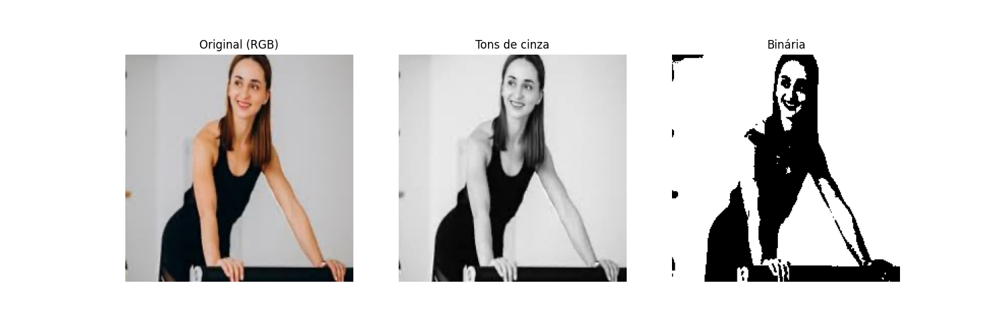

<h1 align="center">Transformação de Imagens</h1>

Programa em Python para converter imagem colorida em tons de cinza e preto e branco para reduzir o tamanho e facilitar treinamento de algoritmos de machine learning.
Mostra o tamanho ocupado em memória de cada imagem e mostra as três imagens lado a lado.
É possível modificar o limiar entre branco e preto variando o valor da variável limiar.

  

